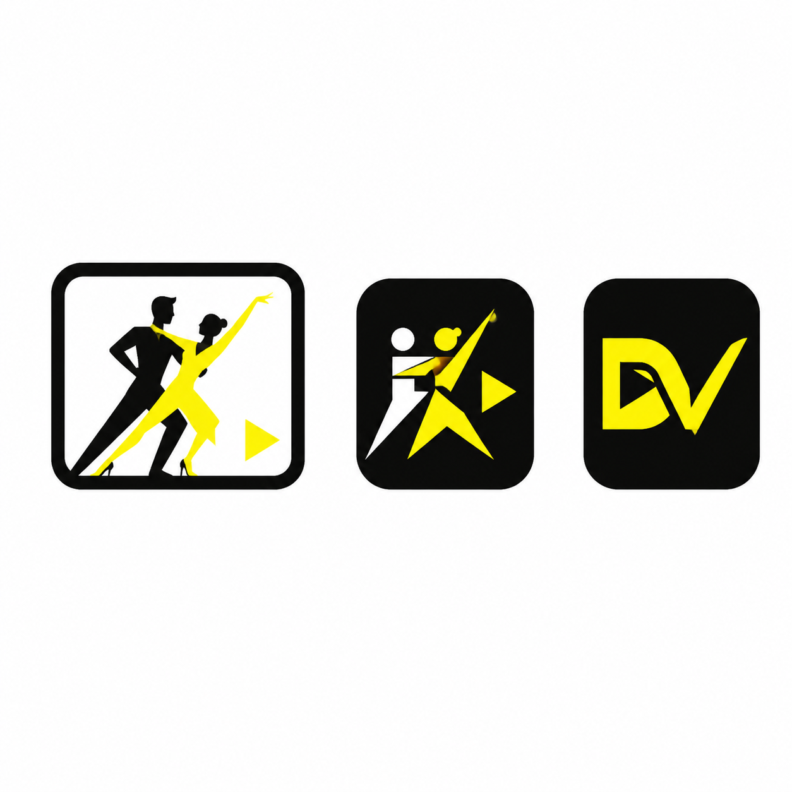

# DanceVault Logo Direction

This concept sheet records a possible logo system. It is visual reference,
not a production asset.

## Preferred Direction

- The first, leftmost mark is the preferred primary logo. A partnered dancing
  couple inside a video frame clearly communicates both dance and video.
- The second mark is a promising compact app/sidebar icon, but the generated
  geometry contains visible AI artifacts. It should be redrawn manually as a
  clean SVG with fewer, more deliberate shapes.
- The third `DV` monogram is a promising favicon and very-small-icon direction,
  but it also needs a manual SVG redesign to remove artifacts and improve the
  letter construction.

## Intended Logo System

1. **Primary logo:** detailed dance-couple and video-frame mark for larger
   branding surfaces.
2. **Compact app mark:** simplified derivative for the sidebar and icons around
   32-48 pixels.
3. **Favicon:** geometric `DV` derivative that remains recognizable at 16-32
   pixels.
4. **Future platform icons:** refined compact mark exported as Apple touch and
   PWA icon sizes.

Use the existing DanceVault palette: bright lemon yellow (`#ffef00`) and
near-black (`#11110f`). Final assets should be deterministic, manually refined
SVGs rather than direct exports of this generated raster concept.
